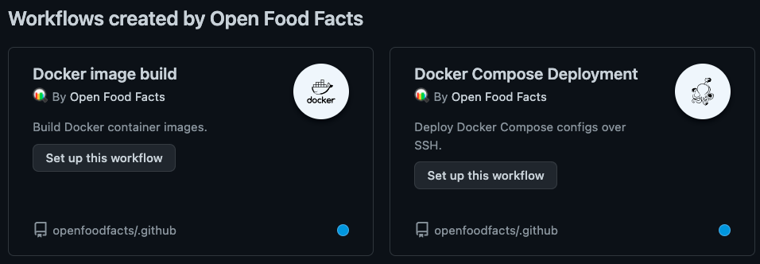
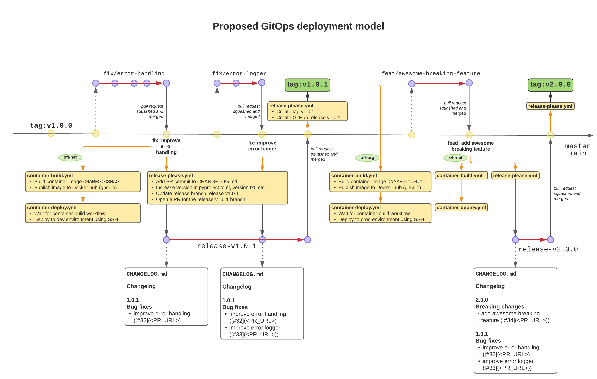
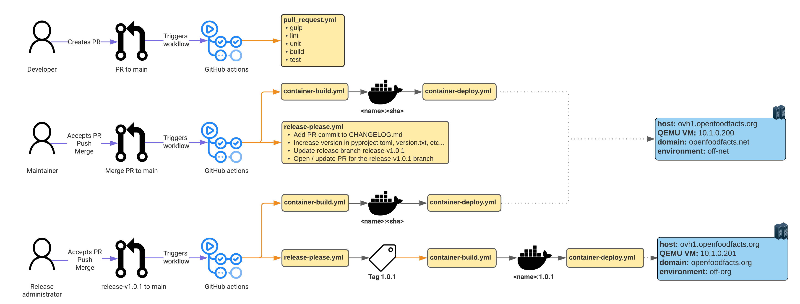

# Continous Integration and Continuous Delivery

This document presents the Continous Integration and Continous Delivery (CICD) process at Open Food Facts. 

The information below is valid for most OFF repositories containing apps deployed on OFF servers. A summary table is given at the end to get the status of the deployment / test automation across different OFF repositories.

## Technology stack

This section gives an overview on the technologies used to automate the CI and CD process at Open Food Facts. Feel free to skip it if you already know these technologies !

### Docker (*idempotency*)

The process of dockerizing applications is an important step towards achieving a modern-day great Continuous Integration and Continous Delivery process.

**Dockerization** avoids common pitfalls in deployment processes, such as having to write idempotent deployment scripts to deploy an application. A Docker container build can be run many times producing each time the same resulting image.

Most of Open Food Facts git repositories have a `Dockerfile` that is used both to test changes locally, but also to ease automated testing and automated deployments through **idempotency** (a.k.a repeatabilty, or the ability to re-run a deployment X times without problems).

### Docker-Compose (*orchestration*)

We use `docker-compose` to deploy our applications to our servers: it is a simple **orchestator** that can deploy to a single machine at once.

An alternative like `docker swarm` or `kubernetes` could be considered in the future to deploy to multiple machines at scale, but it currently does not make much sense considering the small amount of servers used to run Open Food Facts.

### Env file (*secret management*)

Every OFF repo has a `.env` file that contains the secrets needed by the application to run properly. The `.env` file is loaded by the `docker-compose` commands.

The default `.env` file in the repo is ready for local development and should rarely be modified.

In pre-production and production, the `.env` file is populated by the GitHub action (using GitHub environment secrets) before deploying to the target environment.

**Warnings:** 
* The default `.env` file should rarely change. If you need a different environment locally, create a new env file (e.g `.env.test`) and set `ENV_FILE=.env.test` before running the `Makefile` commands. 
* Do not commit your env files to the repos !
* you may use `direnv` to override some variables on a folder basis. See [how-to for openfoodfacts-server](https://github.com/openfoodfacts/openfoodfacts-server/blob/main/docs/how-to-guides/use-direnv.md)

### Makefile (*uniformity*)

A `Makefile` proves very useful for wrapping up and centralizing all the commands we run (locally or on remote environments) and have a lighter development and deployment process using simpler aliases.

Open Food Facts **contributors** should know that the Makefile is the simplest entrypoint for collaborating to Open Food Facts repos, although they are not mandatory if the user have a good knowledge of the application at hand.

`Makefile`s should stay away from complexities when possible and be streamlined enough that we can easily understand what the commands stand for.

It is important to be able to switch between the different Open Food Facts repositories but keep the same interface to set up our local developer workflow. 

Most of the existing OFF repos try to have the commands below in their `Makefile`:

* `make dev` is the only command needed to set up a complete developer environment after cloning the repo. It should hopefully never fail, but if it does anyway please open an issue to track it.

* `make up`, `make down`, `make hdown`, `make restart`, `make status` map exactly to `docker-compose` commands, respectively `docker-compose up`, `docker-compose down`, `docker-compose down -v`, `docker-compose restart` and `docker-compose ps`.

Using a different `.env` file (e.g: `.env.test`) is supported by setting the env variable `ENV_FILE=.env.test` so that the Make commands still work.

### GitHub Actions

We use GitHub Actions to automatically run tests pull requests (unit / integration / lint / performance), but also to build and deploy Docker containers to pre-production and production environments.

GitHub actions workflows are stored in `.github/workflows` in each repository.

In order to ease the deployments of new repositories and have uniform deployments across OFF apps, 2 GitHub Actions workflow templates were created, which can be setup by going to the `Actions` tab on the GitHub repo and selecting the "Docker image build" and "Docker Compose Deployment" actions:

## Continuous Integration

**Continous integration** (CI) is the practice of automating the integration of code 
changes from multiple contributors into a single software project.

It is thus essential in the DevOps space, as it allows developers
to frequently merge code changes into a central repository where builds and tests are run.

A good CI process consists of the following:

* **On pull requests**, run `style checks` as well as `unit`, `integration`, and `performance` tests.
* **On merge to `main` branch**, deploy to a live environment and run integration tests on it.

## Continuous Delivery

Continuous Delivery (CD) is the process of automatically deploying build 
artifacts (Docker containers, tars, static assets, data, etc…) to the target 
environment servers.

### Deployment model

The diagram below represents a standard development git tree and how the deployment process wraps up
around it. It shows the developers workflow to get a change into 
`net` and `org` environments, with the following principles in mind:

* A pull request needs to be tested automatically before an administrator can merge it. Additionally, an administrator can deploy it to pre-production by pushing the PR branch to a new branch called `deploy-<something>`.

* Any change needs to be successfully deployed to pre-production before it is deployed to production.

* No humans should have to worry about making releases. The process should be fully automated.

The following diagram represents the same process, but seen from a persona perspective (Developer, Maintainer, Release Administrator):

**Summary:**

* On **pull requests**: run the `pull_request.yml` Github Action workflow that builds and runs unit / integration / load tests locally.
* On **commit to `master` / `main`**: 
  * run the `release-please.yml` workflow that will **create a release branch** or **add the commit to an existing release branch**; 
  * run the `container-build.yml` workflow that will **build the container image** and **tag it with the merge commit SHA**
  * run the `container-deploy.yml` workflow that will **deploy the container image to the pre-production `.net` environment**.
* On **merge of branches matching `release-v*.*.*`**, run the `release-please.yml` workflow that will create the `v*.*.*` tag.
* On **push to tags matching `v*.*.*`**, run the `container-deploy.yml` workflow that will reload the container image to the off-org environment. The version tag is automatically created when merging a release branch.
* On **push to branches matching `deploy-*`**, run the `container-deploy.yml` workflow that will push the image to the pre-production (`.net`) environment. This is useful to quickly test a pull request in the pre-prod environment to see if it breaks anything.

*Notes:*
* deployment process to pre-prod `.net` and production `.org` environments is identical (`container-deploy.yml`), as pre-production should be as close as possible to the production environment to avoid any pitfalls when pushing a release to production.
* the special branches (`deploy-*` and `release-v*.*.*`) MUST be **[protected branches](https://docs.github.com/en/repositories/configuring-branches-and-merges-in-your-repository/defining-the-mergeability-of-pull-requests/about-protected-branches)**.
* deploying to production `.org` can also be done manually by pushing a tag to the repository that follows semantic versioning: `git tag v1.1.0tc1 && git push --tags` although this is not recommended as it contradicts with the automated deployment workflow.

### Rollbacks

In the advent where pre-production or production environments are broken by a 'bad' change, it is important to be able to rollback to the previous version.

Automated rollbacks are tricky with `docker-compose` (a discussion to migrate to `docker swarm` should be envisioned), but manual rollbacks are easily done.

The steps for executing a manual rollback are as follow:

* SSH to the QEMU VM (either pre-production or production) and go to the deployment folder (usually named after the GitHub environment we are deploying to)
* Replace the `TAG` variable by `sha-<COMMIT_SHA>` (where `COMMIT_SHA` is the last 'good' commit) in the `.env` file and restore it in the checked out repository.
* Copy the `.env` file outside of the checked out repository so that it can be restored later.
* Run `git checkout -qf <COMMIT_SHA>` of the last 'good' commit.
* move the `.env` file from previous step into the directory

Note that since deployments are automated, the following alternative also exists and is safer, although it can be a bit longer considering the git process:

* Revert the 'bad' commit (`git revert <COMMIT_SHA>`) and make a pull request
* Push to a branch called `deploy-<something>` to deploy to pre-prod
* **Merge the pull request**: the release workflow runs and creates a new release branch.
* **Merge the release branch**: the revert will be deployed in production.

## CICD status

The current status of the automation of the deployment and testing processes across Open Food Facts repositories is as follows:

| Repository                                                                            | Continuous Testing   | Continuous Deployment | Pre-production deployment | Production deployment                          | Release automation |
|---------------------------------------------------------------------------------------|----------------------|-----------------------|---------------------------|------------------------------------------------|--------------------|
| [openfoodfacts-server](https://github.com/openfoodfacts/openfoodfacts-server)         | Weak (lint, unit)    | Good                  | Automated                 | Manual                                         | Automated          |
| [robotoff](https://github.com/openfoodfacts/robotoff)                                 | Weak (lint, unit)    | Good                  | Automated                 | Automated                                      | Automated          |
| [robotoff-ann](https://github.com/openfoodfacts/robotoff-ann)                         | Weak (lint, unit)    | Good                  | Automated                 | Automated                                      | Automated          |
| [impactestimator](https://github.com/openfoodfacts/impactestimator)                   | Weak                 | Good                  | Automated                 | Automated                                      | Automated          |
| [openfoodfacts-monitoring](https://github.com/openfoodfacts/openfoodfacts-monitoring) | None                 | Good                  | Automated                 | Automated                                      | Automated          |
| [smooth-app](https://github.com/openfoodfacts/smooth-app)                             | Weak (lint, flutter) | Good                  | None                      | Automated (deployment to Android + IOS stores) | Automated          |

## Q&A

### Container deployment is failing, how do I fix it ?
Have a look at the `Actions` tab in the GitHub repository and finds out why it 
is failing. If the process has trouble checking out the appropriate commit sha, 
you might have to ssh to the machine, bring down the deployment (`make down`) 
and delete the repository folder. It will be automatically re-created for the 
next deployment.

### I forgot to set an env variable on GitHub, can I re-trigger the deployment ?

Yes, simply make an empty commit to your deployment branch:
`git commit --allow-empty -m "trigger" && git push`. 
You can also re-trigger a deployment in the repo's `Actions` tab, assuming you are a repo maintainer.

### How do I set up a deployment on a new repository ?

Go to the `Actions` tab and click on `New workflow`: scroll down to `Workflows created by Open Food Facts` and click on `Set up this workflow` for both `Docker image build` and `Docker Compose Deployment` workflows. It will generate pre-configured workflow files in `.github/workflows` that you can then tweak to your needs and commit to the repository.

You will also need to create two GitHub environments (in Settings > Environments) and set up a few secrets needed by the deployment, mainly `HOST`, `SSH_PRIVATE_KEY`, `PROXY_HOST` and `USERNAME`.

### What do I do if the deployment fails after merging my PR to the `main` or `master` branch ?

Contact an OFF administrator to analyze why it is failing: the admin might have 
to revert your PR to restore the previous working version in pre-production; you 
can then continue to work on your branch to fix the problem, and make another PR.

Ask the OFF administrator to deploy your PR before merging it, so that it is 
known ahead of time if the PR will break the pre-production environment.

### I don't have much confidence in the next release, can I make a release candidate before publishing the official release ?

Yes, assuming your next version is `v1.1.0`, just create a git tag following semantic versioning using `git tag v1.1.0rc1 && git push --tags` and the automated process will deploy this release candidate to production.
